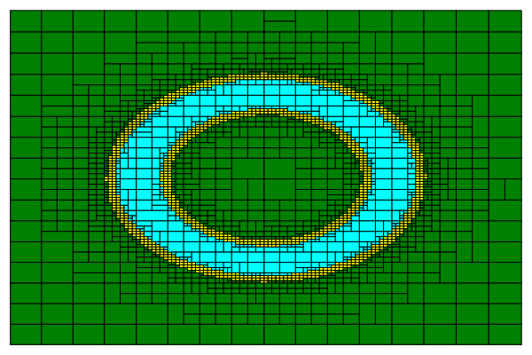

# PaveReach

Paving of a set describing a quantified constraint problem, using general reachability.

<p align="center">
  
</p>

We refer here to sections, figures and tables of the article that uses this artifact.

## Gist of the program

```julia
include("pave.jl")
...
inn, out, delta = paving11(...)
```

For a quantified set $\Sigma$, the paving function `paving11` returns
- the inside $\Sigma^-$ in  `inn`,
- the outside $(\Sigma^\complement)^-$ in `out`,
- and the potential boundary $\Sigma^\Delta$ in `delta`.

For the different paving functions, see [Oracles](#oracles).

## Dependencies

`PaveReach` relies on `GenReach` ([repo](https://github.com/goubault/GenReach)). In this prototype, the file `genreach.jl` from `GenReach` has been copied, altered and renamed `genreach2.jl`.

### List of the packages

For `GenReach`
* `IntervalArithmetic`
* `LazySets`
* `Polyhedra`
* `StaticArrays`
* `Symbolics`
* `CDDLib`

For `PaveReach`
* `Match`
* `Plots`
* `ArgParse`
* `LaTeXStrings`
* `BenchmarkTools`

### Adding a package

Call `julia` to get in the interactive REPL.
You will get to the `julia>` prompt.
```julia
julia>
```
Type `]` to get to the Pkg REPL-mode (the built-in Julia package manager).
```julia
pkg>
```
Add one package as follows.
```julia
pkg> add <name_of_the_package>
```
Or add all the packages at once.
```julia
pkg> add IntervalArithmetic LazySets Polyhedra StaticArrays Symbolics CDDLib Match Plots ArgParse LaTeXStrings BenchmarkTools
```
To return to the `julia>` prompt, either press backspace when the input line is empty or press `Ctrl+C`.

## Generating associated experimental results (figures and tables)

The scripts `Fig<n>.sh` where `<n>` is in {3, 4, ..., 9} produce  `.png` files in order to construct the corresponding figures.

The scripts `Tab<n>.sh` where `<n>` is in {3, 4, 5} produce `.log` reports in order to construct the corresponding tables.

## Quick start

### Try a 2D toy example

Run (no command line argument, everything is hardcoded):
```
julia ex_0-1_disk.jl
```
It should return:
```
ϵ_x  = 0.1
ϵ_p  = 0.5
Not refined
Normal bisection on P
Undecided domain: 2.6 %
The result was saved in ex_0-1_disk_11_0.1_0.5_subdivided.png.
```
You will find the output in a file named `ex_0-1_disk_11_0.1_0.5_subdivided.png`.

### Try the running example from the article (Section 5.1)

Run
```
julia ex_5-1_running_example.jl 1 1 0.1 --save
```
It should return (with the execution time instead of `<time>`):
```
O^IN_1, O^OUT_1
ϵ_x  = 0.1
ϵ_p = nothing
Not refined
No standard bisection on P
  <time> ms (19787 allocations: 712.52 KiB)
Undecided domain: 18.8 %
The result was saved in ex_5-1_running_example_11_0.1.png.
```
You will find the output in a file named `ex_5-1_running_example_11_0.1.png`.

## What the examples do

### Explanation for a 2D example (`ex_0-1_disk.jl`)

> Note: the example is degenerated, there is no parameter $\mathbb{P}$.

The example in `0-1_disk.jl` sets up the scalar problem:
$$\{ x \in [-5, 5] \times [-5, 5] \, | \, \exists z \in [0, 16], f(x, z) = x_1^2 + x_2^2 - z = 0 \}.$$

- Domain for x: $\mathbb{X}_0 = [-5, 5] \times [-5, 5]$
- Parameters and quantifiers: none
- Target: $\mathbb{G} = [0, 16]$
- Paving precision: $\epsilon_{\mathbb{X}} = 0.1$
- Parameter subdivision precision: $\epsilon_{\mathbb{P}} = 0.5$

Check the detailed explanation of the script [here](README_ex_0-1_disk.md).

### Explanation for a 1D example (`ex_5-1_running_example.jl`)

The example in `ex_5-1_running_example.jl` sets up the scalar problem:
$$\{ x \in [-5, 5] \, | \, \forall p_1 \in [0, 1/4], f(x, p_1) = p_1^2 - (x - 1)(x - 2)(x - 3) \in [-1/4, 1/4] \}.$$

- Domain for $x$: $X_0 = [-5, 5]$
- Parameters and quantifiers: $∀ p_1 ∈ [0, 1/4]$
- Target: $\mathbb{G} = [-1/4, 1/4]$

Check the detailed explanation of the script [here](README_ex_5-1_running_example.md).

In order to pave with 
- $\mathcal{O}^{IN}$ using $\mathbb{P}$ and $\mathbb{G}$,
- $\mathcal{O}^{OUT}$ using $\mathbb{P}$ and $\mathbb{G}$
- and $\epsilon_\mathbb{X} = 0.1$,

run
```
julia ex_5-1_running_example.jl 1 1 0.1
```
The first two arguments, `1` and `1`, select the paving function `pave11`. See [Oracles](#oracles). The third argument, `0.1` corresponds to $\epsilon_\mathbb{X}$.

In order to pave with subdivision as in Section 4.1,
- $\mathcal{O}^{IN}$ using $\mathbb{P}$ and $\mathbb{G}$,
- $\mathcal{O}^{OUT}$ using $\mathbb{P}$ and $\mathbb{G}$,
- $\epsilon_\mathbb{X} = 0.1$
- and $\epsilon_\mathbb{P} = 0.1$,

run
```
julia ex_5-1_running_example.jl 1 1 0.1 0.1 --subdivide
```

The output can be saved with the option `--save`.
To get more information, use
```
julia ex_5-1_running_example.jl --help
```
```
usage: ex_5-1_running_example.jl [-r] [-s] [--save] [-h] o_in o_out
                        eps_x [eps_p]

positional arguments:
  o_in             oracle for IN (type: Int64)
  o_out            oracle for OUT (type: Int64)
  eps_x            epsilon for the paving (type: Float64)
  eps_p            epsilon for the parameters (type: Float64)

optional arguments:
  -r, --refine     bisect the parameters with ∀ and replace the ones
                   with ∃ by points (or vice versa), requires eps_p,
                   does not work with --subdivide
  -s, --subdivide  bisect the parameters with either ∀ or ∃, requires
                   eps_p, does not work with --refine
  --save           save the output
  -h, --help       show this help message and exit
```

## Quantified constraint problem

### General case

The `QuantifiedConstraintProblem` type aggregates the information needed to compute the reachability with `GenReach`.
```julia
n = 2
...
# problem := f, Df
problem = Problem(f_fun, Df_fun)
# Quantified variables
qvs = ...
# Relaxed quantified variables
qvs_relaxed_1 = ...
qvs_relaxed_2 = ...
# Quantifier elimination problem
qcp = QuantifiedConstraintProblem(problem, qvs, [qvs_relaxed_1, qvs_relaxed_2], p, n)
```
See the examples for further details.

### For a scalar-valued function

For scalar-valued functions, one simply needs to do
```julia
n = 1
...
# Quantifier elimination problem
qcp = QuantifiedConstraintProblem(problem, qvs, [qvs], p, n)
```
In this case, `qvs` is just repeated between `[` and `]`.

### `Problem`

A `Problem` is constructed from a function `f_fun` and the function which computes its Jacobian `Df_fun`.
```julia
# problem := f, Df
problem = Problem(f_fun, Df_fun)
```
There is a utility function `build_function_f_Df` which builds both functions, `f_fun` and `Df_fun`, from the expression of the function.
```julia
n = ...
p = ...
@variables x[1:p]
f_num = [...]
f_fun, Df_fun = build_function_f_Df(f_num, x, n, p)
```

### Quantified variables

A quantified variable is the tuple made of a quantifier (`Forall` or `Exists`) and an integer.
```julia 
# ∀ x_1
qv_1 = (Forall, 1)
# ∃ x_5
qv_2 = (Exists, 5)
```

In the definition of the problem, the first quantified variables are reserved for the free variables. The last `n` ones are reserved for the components of $\mathbb{G} \subseteq \mathbb{R}^n$. One has to specify the quantifiers for $\mathbb{P}$. They can be numbered with the remaining values.

For example, in `ex_5-4_circle_collision.jl` the problem is
$$\{(x, y) \in [-5, 5]^2 \, | \, \forall t \in [-\pi, \pi],(2.5*sin(t) - x)^2 + (2.5*cos(t) - y)^2 \in [0.25, +\infty]\}$$

Even though the total number of variable is `p=4`, one only has to specify the quantifier for the third variable
```julia
# x[1] := x, x[2] := y, x[3] := t, x[4] := d
qvs = [(Forall, 3)]
```

The first two variables correspond to the free variables, $x$ and $y$, of the 2D problem and the last one is $d \in \mathbb{G}$ (`n=1`). Their quantifiers are handled by the algorithm.

## Oracles

Select one of the four paving functions according to this table

|   | $\mathcal{O}^{OUT}$ using $\mathbb{P}$ and $\mathbb{G}$ | $\mathcal{O}^{OUT}$ using $\neg\mathbb{P}$ and $\mathbb{G}^\complement$
|---|---|---
| $\mathcal{O}^{IN}$ using $\mathbb{P}$ and $\mathbb{G}$                  | `pave11` | `pave12`
| $\mathcal{O}^{IN}$ using $\neg\mathbb{P}$ and $\mathbb{G}^\complement$ | `pave21` | `pave22`

> Note: the user does not have to construct $\neg\mathbb{P}$ or $\mathbb{G}^\complement$. The four paving functions take $\mathbb{P}$ and $\mathbb{G}$ as input, so swapping between the functions amounts only to changing the name of the function.

## Parameter subdivision

No parameter subdivision:
```julia
inn, out, delta = pave_11(X_0, p_in, p_out, G, qcp, ϵ_x, nothing, false, false)
```
Subdivision as in Section 4.1:
```julia
inn, out, delta = pave_11(X_0, p_in, p_out, G, qcp, ϵ_x, ϵ_p, false, true)
```
Points/subdivision as in Section 4.2:
```julia
inn, out, delta = pave_11(X_0, p_in, p_out, G, qcp, ϵ_x, ϵ_p, true, false)
```

## Saving the output

```julia
p = plot()
draw(p, X_0, inn, out, delta)
plot(p)
outfile = ...
savefig(outfile)
println("The result was saved in $(outfile).")
```

## Displaying the output

```julia
p = plot()
draw(p, X_0, inn, out, delta)
plot(p)
gui()
```

Run the script in interactive mode in order to keep the REPL open to visualize the plot.

```
julia -i ...
```