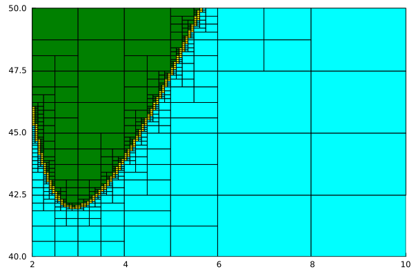
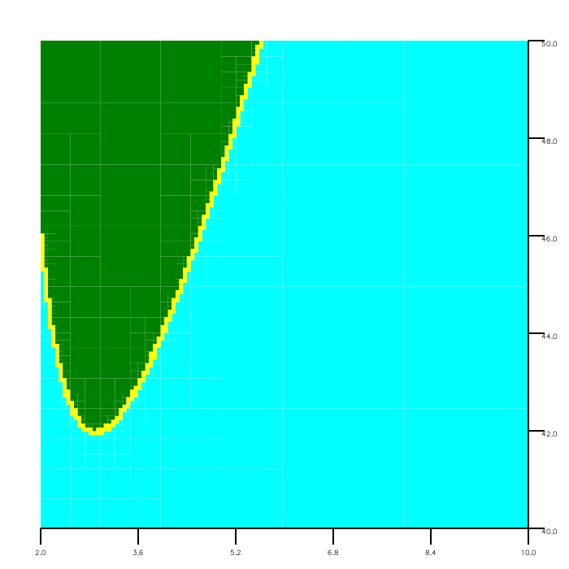

# PaveReach

Paving of a set describing a quantified constraint problem, using general reachability.

<p align="center">
  
</p>

We refer here to sections, figures and tables of the paper that uses this artifact.

## Gist of the program

```julia
include("pave.jl")
...
inn, out, delta = paving_11(...)
```

For a quantified set $\Sigma$, the paving function `paving_11` returns
- the inside $\Sigma^-$ in  `inn`,
- the outside $(\Sigma^\complement)^-$ in `out`,
- and the potential boundary $\Sigma^\Delta$ in `delta`.

For the different paving functions, see [Oracles](#oracles).

## Reproducing associated experimental results (figures and tables) with a Docker image

The scripts `Fig<n>.sh` where `<n>` is in {3, 4, ..., 9} produce  `.png` files in order to construct the corresponding figures.

The scripts `Tab<n>.sh` where `<n>` is in {3, 4, 5} produce `.log` reports in order to construct the corresponding tables.

> Note: In the paper, timings were computed on a 12th
Gen Intel(R) Core(TM) i7-12700H processor with a clock rate of
3.50 GHz and a 16 Gio RAM. They ran on a Dell Inc. Precision 3571 using Ubuntu 24.04.3 LTS. There may be great disparities with other platforms.

In our experiments, the pavings of Figure 3 were respectively computed
* in 1 ms, 3 ms and 21 ms on the Ubuntu machine and
* in 430 ms, 1 s and 8 s on a macOS machine.

In Table 3, this corresponds to the first three lines of the first column.

> Note: Timings of our algorithm are obtained with the macro `@btime` from `BenchmarkTools`. The timings mentioned in the paper reflect the call to the paving function (`pave_11` for example). Running an example includes the compilation in Julia, the construction of the problem, the paving which we time and the creation of an output. So the total execution time might be long. The mean of certain number of samples are taken into account for the timing by `@btime`. In the files `ex_5-...`, that number is set with the field `samples` at the end of the line starting with `@btime`. Feel free to set `samples=1` if you just wish to have a general idea of the timings. Otherwise, beware that running some of the following benchmarks may take some considerable time.

### Requirement

Make sure that you have [Docker](https://docs.docker.com/get-started/) installed and running.

### Building the Docker image

Get in the root directory, where you can find the `Dockerfile` and `Makefile` files. Run the `make` command in order to build the image that we will name `globalqe` and change the mode of the scripts to execute.
```
make
```

### Running the experiments

> Note: The output figures are generated with `Luxor` when using the Docker image, while they were generated with `Plots` in the paper. The results are the same, only the visualization differs. This choice was made due to technical reasons: it is possible to generate the exact output figures with the Julia files directly.

<p align="center">
     </br>
    Figure 5 with Plots
</p>
<p align="center">
     </br>
    Figure 5 with Luxor
</p>

#### Figure 3

Paving of the running example (Section 5.1) by Algorithm 1 for $\epsilon_\mathbb{X} = 0.1$, $\epsilon_\mathbb{X} = 0.01$ and $\epsilon_\mathbb{X} = 0.001$.

Run
```
./Fig3.sh
```
`ex_5-1_running_example_11_0.1.png` ($\epsilon_\mathbb{X} = 0.1$), `ex_5-1_running_example_11_0.01.png` ($\epsilon_\mathbb{X} = 0.01$) and `ex_5-1_running_example_11_0.001.png` ($\epsilon_\mathbb{X} = 0.001$) appear in `examples/`.

#### Figure 4

Paving of the running example (Section 5.1) for $\epsilon_\mathbb{X} = \epsilon_\mathbb{P} = 0.001$ with the different oracles.

Run
```
./Fig4.sh
```
`ex_5-1_running_example_11_0.001.png` (Lemmas 3.1 and 3.2), `ex_5-1_running_example_11_0.001_subdivided.png` (Lemmas 4.2 and 4.3) and `ex_5-1_running_example_11_0.001_refined.png` (Lemmas 4.4 and 4.5) appear in `examples/`.

#### Figure 5

Paving of GarloffGraf1 (Section 5.2) for $\epsilon_\mathbb{X} = 0.1$.

Run
```
./Fig5.sh
```
`ex_5-2_stability_controller_0.1.png` appears in `examples/`.

#### Figure 6

Paving of the Dubins example (Section 5.3) with $\epsilon_\mathbb{X} = \epsilon_\mathbb{P} = 0.01$.

Run
```
./Fig6.sh
```
`ex_5-3_dubins_0.01_nothing_x.png` ($x$), `ex_5-3_dubins_0.01_nothing_y.png` ($y$) and `ex_5-3_dubins_0.01_nothing_theta.png` ($\theta$) appear in `examples/`.

#### Figure 7

Paving of the circle collision problem (Section 5.4) with $\epsilon_\mathbb{X} = \epsilon_\mathbb{P} = 0.1$, using Lemma 4.4 and Lemma 4.5.

Run
```
./Fig7.sh
```
`ex_5-4_circle_collision_0.1_0.1_refined.png` appears in `examples/`.

#### Figure 8

Paving of the robot collision problem (Section 5.5) with $\epsilon_\mathbb{X} = \epsilon_\mathbb{P} = 0.01$, using Lemma 4.4 and Lemma 4.5.

Run
```
./Fig8.sh
```
`ex_5-5_robot_collision_0.01_0.01_refined.png` appears in `examples/`.

#### Figure 9

Paving of the robot collision problem (Section 5.5) with $\epsilon_\mathbb{X} = \epsilon_\mathbb{P} = 0.1$ using Lemmas 3.1 and 3.2, 4.2 and 4.3, and 4.4 and 4.5.

Run
```
./Fig9.sh
```
`ex_5-5_robot_collision_11_0.1.png` (Lemmas 3.1 and 3.2), `ex_5-5_robot_collision_11_0.1_0.1_subdivided.png` (Lemmas 4.2 and 4.3) and `ex_5-5_robot_collision_11_0.1_0.1_refined.png` (Lemmas 4.4 and 4.5) appear in `examples/`.

#### Table 3

Proportion of undecided domain and timings for the running example (Section 5.1), with and without parameter subdivision.

Run
```
./Tab3.sh
```
Data (undecided region and timing) to produce Table 3 is saved in `Tab3.log` in the root directory.

#### Table 4

Proportion of the undecided domain for the running example (Section 5.1) using Lemma 4.2 and Lemma 4.3.

Run
```
./Tab4.sh
```
Data (undecided region) to produce Table 4 is saved in `Tab4.log` in the root directory.

#### Table 5

Proportion of the undecided domain for the running example (Section 5.1) using Lemma 4.4 and Lemma 4.5.

Run
```
./Tab5.sh
```
Data (undecided region) to produce Table 5 is saved in `Tab5.log` in the root directory.

### Additional functionalities

One can play with the choices of oracle, precision and paving improvement method for each example. Try getting the help message for the running example for instance:
```
docker run globalqe examples/ex_5-1_running_example.jl --help
```
In order to obtain the images, create a bind mount `-v /HOST-DIR:/CONTAINER-DIR`. We suggest `-v .:/app` (see how it is done in `Fig3.sh` for example). Try
```
docker run -v .:/app globalqe examples/ex_5-1_running_example.jl 2 2 0.5 --with_luxor
```
for $\mathcal{O}^{IN}$ using $\neg\mathbb{P}$ and $\mathbb{G}^\complement$, $\mathcal{O}^{OUT}$ using $\neg\mathbb{P}$ and $\mathbb{G}^\complement$ and $\epsilon_{\mathbb{X}} = 0.5$. More details can be found [below](#explanation-for-a-1d-example-ex_5-1_running_examplejl).

The different files are:
* `ex_5-1_running_examples.jl`
* `ex_5-1_running_examples_no_timing.jl` (does not call `BenchmarkTools`)
* `ex_5-2_stability_controller.jl`
* `ex_5-3_dubins.jl`
* `ex_5-4_circle_collision.jl`
* `ex_5-5_robot_collision.jl`

## Reusing the artifact
### Dependencies

`PaveReach` relies on `GenReach` ([repo](https://github.com/goubault/GenReach)) from reference [10] in the paper. In the present prototype, the file `genreach.jl` from `GenReach` has been copied, altered and renamed `genreach2.jl`.

#### List of the packages

For `GenReach`
* `IntervalArithmetic` v0.21.2
* `LazySets` v2.14.2
* `Symbolics` v6.31.0

For `PaveReach`
* `Match` v2.4.1
* `Plots` v1.41.5
* `ArgParse` v1.2.0
* `LaTeXStrings` v1.4.0
* `BenchmarkTools` v1.6.3
* `Luxor` v4.3.0
* `MathTeXEngine` v0.6.7

#### Adding a package

Call `julia` to get in the interactive REPL.
You will get to the `julia>` prompt.
```julia
julia>
```
Type `]` to get to the Pkg REPL-mode (the built-in Julia package manager).
```julia
pkg>
```
Add one package as follows.
```julia
pkg> add <name_of_the_package> [@<version>]
```
Or add all the packages at once.
```julia
pkg> add IntervalArithmetic @0.21.2 LazySets @2.14.2 Polyhedra @0.8.1 StaticArrays @1.9.16 Symbolics @6.31.0 CDDLib @0.10.2 Match @2.4.1 Plots @1.41.5 ArgParse @1.2.0 LaTeXStrings @1.4.0 BenchmarkTools @1.6.3 Luxor @4.3.0 MathTeXEngine @0.6.7
```
To return to the `julia>` prompt, either press backspace when the input line is empty or press `Ctrl+C`.

### Quick start

#### Try a 2D toy example

Run (no command line argument, everything is hardcoded):
```
julia ex_0-1_disk.jl
```
It should return:
```
ϵ_x  = 0.1
ϵ_p  = 0.5
Not refined
Normal bisection on P
Undecided domain: 2.6 %
The result was saved in ex_0-1_disk_11_0.1_0.5_subdivided.png.
```
You will find the output in a file named `ex_0-1_disk_11_0.1_0.5_subdivided.png`.

#### Try the running example from the paper (Section 5.1)

Run
```
julia ex_5-1_running_example.jl 1 1 0.1 --with_plots
```
It should return (with the execution time instead of `<time>`):
```
O^IN_1, O^OUT_1
ϵ_x  = 0.1
ϵ_p = nothing
Not refined
No standard bisection on P
  <time> ms (19787 allocations: 712.52 KiB)
Undecided domain: 18.8 %
The result was saved in ex_5-1_running_example_11_0.1.png.
```
You will find the output in a file named `ex_5-1_running_example_11_0.1.png`.

### What the examples do

#### Explanation for a 2D example (`ex_0-1_disk.jl`)

> Note: the example is degenerated, there is no parameter $\mathbb{P}$.

The example in `0-1_disk.jl` sets up the scalar problem:
$$\{ x \in [-5, 5] \times [-5, 5] \, | \, \exists z \in [0, 16], f(x, z) = x_1^2 + x_2^2 - z = 0 \}.$$

- Domain for x: $\mathbb{X}_0 = [-5, 5] \times [-5, 5]$
- Parameters and quantifiers: none
- Target: $\mathbb{G} = [0, 16]$
- Paving precision: $\epsilon_{\mathbb{X}} = 0.1$
- Parameter subdivision precision: $\epsilon_{\mathbb{P}} = 0.5$

Check the detailed explanation of the script [here](README_ex_0-1_disk.md).

#### Explanation for a 1D example (`ex_5-1_running_example.jl`)

The example in `ex_5-1_running_example.jl` sets up the scalar problem:
$$\{ x \in [-5, 5] \, | \, \forall p_1 \in [0, 1/4], f(x, p_1) = p_1^2 - (x - 1)(x - 2)(x - 3) \in [-1/4, 1/4] \}.$$

- Domain for $x$: $X_0 = [-5, 5]$
- Parameters and quantifiers: $\forall p_1 \in [0, 1/4]$
- Target: $\mathbb{G} = [-1/4, 1/4]$

Check the detailed explanation of the script [here](README_ex_5-1_running_example.md).

In order to pave with 
- $\mathcal{O}^{IN}$ using $\mathbb{P}$ and $\mathbb{G}$,
- $\mathcal{O}^{OUT}$ using $\mathbb{P}$ and $\mathbb{G}$
- and $\epsilon_\mathbb{X} = 0.1$,

run
```
julia ex_5-1_running_example.jl 1 1 0.1
```
The first two arguments, `1` and `1`, select the paving function `pave11`. See [Oracles](#oracles). The third argument, `0.1` corresponds to $\epsilon_\mathbb{X}$.

In order to pave with subdivision as in Section 4.1,
- $\mathcal{O}^{IN}$ using $\mathbb{P}$ and $\mathbb{G}$,
- $\mathcal{O}^{OUT}$ using $\mathbb{P}$ and $\mathbb{G}$,
- $\epsilon_\mathbb{X} = 0.1$
- and $\epsilon_\mathbb{P} = 0.1$,

run
```
julia ex_5-1_running_example.jl 1 1 0.1 0.1 --subdivide
```

The output can be saved with the option `--with_plots` or `--with_luxor`.
To get more information, use
```
julia ex_5-1_running_example.jl --help
```
```
usage: ex_5-1_running_example.jl [-r] [-s] [--with_plots]
                        [--with_luxor] [-h] o_in o_out eps_x [eps_p]

positional arguments:
  o_in             oracle for IN (type: Int64)
  o_out            oracle for OUT (type: Int64)
  eps_x            epsilon for the paving (type: Float64)
  eps_p            epsilon for the parameters (type: Float64)

optional arguments:
  -r, --refine     bisect the parameters with ∀ and replace the ones
                   with ∃ by points (or vice versa), requires eps_p,
                   does not work with --subdivide
  -s, --subdivide  bisect the parameters with either ∀ or ∃, requires
                   eps_p, does not work with --refine
  --with_plots     generate the output with Plots.jl
  --with_luxor     generate the output with Luxor.jl
  -h, --help       show this help message and exit
```

### Quantified constraint problem

#### General case

The `QuantifiedConstraintProblem` type aggregates the information needed to compute the reachability with `GenReach`.
```julia
n = 2
...
# problem := f, Df
problem = Problem(f_fun, Df_fun)
# Quantified variables
qvs = ...
# Relaxed quantified variables
qvs_relaxed_1 = ...
qvs_relaxed_2 = ...
# Quantifier elimination problem
qcp = QuantifiedConstraintProblem(problem, qvs, [qvs_relaxed_1, qvs_relaxed_2], p, n)
```
See the examples for further details.

#### For a scalar-valued function

For scalar-valued functions, one simply needs to do
```julia
n = 1
...
# Quantifier elimination problem
qcp = QuantifiedConstraintProblem(problem, qvs, [qvs], p, n)
```
In this case, `qvs` is just repeated between `[` and `]`.

#### `Problem`

A `Problem` is constructed from a function `f_fun` and the function which computes its Jacobian `Df_fun`.
```julia
# problem := f, Df
problem = Problem(f_fun, Df_fun)
```
There is a utility function `build_function_f_Df` which builds both functions, `f_fun` and `Df_fun`, from the expression of the function.
```julia
n = ...
p = ...
@variables x[1:p]
f_num = [...]
f_fun, Df_fun = build_function_f_Df(f_num, x, n, p)
```

#### Quantified variables

A quantified variable is the tuple made of a quantifier (`Forall` or `Exists`) and an integer. For example, $\forall x_1$ and $\exists x_5$ are represented by
```julia 
qv_1 = (Forall, 1)
qv_2 = (Exists, 5)
```

In the definition of the problem, the first quantified variables are reserved for the free variables. The last `n` ones are reserved for the components of $\mathbb{G} \subseteq \mathbb{R}^n$. One has to specify the quantifiers for $\mathbb{P}$. They can be numbered with the remaining values.

For example, in `ex_5-4_circle_collision.jl` the problem is
$$\{(x, y) \in [-5, 5]^2 \, | \, \forall t \in [-\pi, \pi],(2.5*sin(t) - x)^2 + (2.5*cos(t) - y)^2 \in [0.25, +\infty]\}$$

Even though the total number of variable is `p=4`, one only has to specify the quantifier for the third variable
```julia
# x[1] := x, x[2] := y, x[3] := t, x[4] := d
qvs = [(Forall, 3)]
```

The first two variables correspond to the free variables, $x$ and $y$, of the 2D problem and the last one is $d \in \mathbb{G}$ (`n=1`). Their quantifiers are handled by the algorithm.

### Oracles

Select one of the four paving functions according to this table

|   | $\mathcal{O}^{OUT}$ using $\mathbb{P}$ and $\mathbb{G}$ | $\mathcal{O}^{OUT}$ using $\neg\mathbb{P}$ and $\mathbb{G}^\complement$
|---|---|---
| $\mathcal{O}^{IN}$ using $\mathbb{P}$ and $\mathbb{G}$                  | `pave_11` | `pave_12`
| $\mathcal{O}^{IN}$ using $\neg\mathbb{P}$ and $\mathbb{G}^\complement$ | `pave_21` | `pave_22`

> Note: the user does not have to construct $\neg\mathbb{P}$ or $\mathbb{G}^\complement$. The four paving functions take $\mathbb{P}$ and $\mathbb{G}$ as input, so swapping between the functions amounts only to changing the name of the function.

## Parameter subdivision

No parameter subdivision:
```julia
inn, out, delta = pave_11(X_0, p_in, p_out, G, qcp, ϵ_x, nothing, false, false)
```
Subdivision as in Section 4.1:
```julia
inn, out, delta = pave_11(X_0, p_in, p_out, G, qcp, ϵ_x, ϵ_p, false, true)
```
Points/subdivision as in Section 4.2:
```julia
inn, out, delta = pave_11(X_0, p_in, p_out, G, qcp, ϵ_x, ϵ_p, true, false)
```

## Saving the output

### With Plots

```julia
p = plot()
draw(p, X_0, inn, out, delta)
plot(p)
outfile = ...
savefig(outfile)
println("The result was saved in $(outfile).")
```

It is also possible to display the result.

```julia
p = plot()
draw(p, X_0, inn, out, delta)
plot(p)
gui()
```

Run the script in interactive mode in order to keep the REPL open to visualize the plot.

```
julia -i ...
```

### With Luxor

```julia
width = 600
height = 40
buffer = 50
outfile = ...
Drawing(width + 2*buffer, height + 2*buffer, outfile)
luxor_draw(X_0, inn, out, delta, width, height, buffer)
finish()
println("The result was saved in $(outfile).")
```