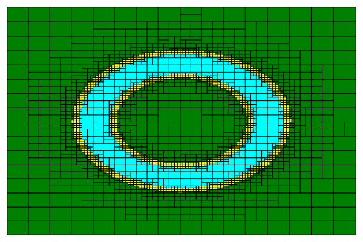

# PaveReach

Paving of a set describing a quantified constraint problem, using general reachability.

<p align="center">
  
</p>

## Gist of the program

```julia
include("pave.jl")
...
inn, out, delta = pave_11(...)
```

For a quantified set $\Sigma$, the paving function `pave_11` returns
- the inside $\Sigma^-$ in  `inn`,
- the outside $(\Sigma^\complement)^-$ in `out`,
- and the potential boundary $\Sigma^\Delta$ in `delta`.

For the different paving functions, see [Oracles](#oracles).

## Using the prototype
### Dependencies

`PaveReach` relies on `GenReach` ([repo](https://github.com/goubault/GenReach)). In the present prototype, the file `genreach.jl` from `GenReach` has been copied, altered and renamed `genreach2.jl`.

#### List of the packages

For `GenReach`
* `IntervalArithmetic` v0.21.2
* `LazySets` v2.14.2
* `Symbolics` v6.31.0

For `PaveReach`
* `Match` v2.4.1
* `Plots` v1.41.5
* `ArgParse` v1.2.0
* `LaTeXStrings` v1.4.0
* `BenchmarkTools` v1.6.3
* `Luxor` v4.3.0
* `MathTeXEngine` v0.6.7
* `NeuralVerification` v0.1.0
* `ONNX` v0.3.0
* `SoleLogics` v0.13.7
* `ReusePatterns` v0.3.1
* `Pandas` v1.6.1

#### Adding a package

Call `julia` to get in the interactive REPL.
You will get to the `julia>` prompt.
```julia
julia>
```
Type `]` to get to the Pkg REPL-mode (the built-in Julia package manager).
```julia
pkg>
```
Add one package as follows and `NeuralVerification` from its repository link.
```julia
pkg> add <name_of_the_package> [@<version>]
pkg> add https://github.com/sisl/NeuralVerification.jl
```
Or add all the packages at once.
```julia
pkg> add IntervalArithmetic @0.21.2 LazySets @2.14.2 Polyhedra @0.8.1 StaticArrays @1.9.16 Symbolics @6.31.0 CDDLib @0.10.2 Match @2.4.1 Plots @1.41.5 ArgParse @1.2.0 LaTeXStrings @1.4.0 BenchmarkTools @1.6.3 Luxor @4.3.0 MathTeXEngine @0.6.7 ONNX @0.3.0 SoleLogics @0.13.7 ReusePatterns @0.3.1 Pandas @1.6.1
pkg> add https://github.com/sisl/NeuralVerification.jl
```
To return to the `julia>` prompt, either press backspace when the input line is empty or press `Ctrl+C`.

### Quick start

#### Try a toy example

Move into the `examples/` folder.

Run:
```
julia ex_0-1_star.jl
```

It should return:
```
ϵ_x: [0.1, 0.1]
Not refined
No standard bisection on P
Paving completed.
	Number of iterations: 995
	Number of evaluations: 1867
Undecided domain: 1.1 %
The result was saved in ex_0-1_star_[0.1, 0.1].png.
```
You will find the output in a file named `ex_0-1_star_[0.1, 0.1].png`.

<!-- #### Try a 2D toy example

Run (no command line argument, everything is hardcoded):
```
julia ex_0-1_disk.jl
```
It should return:
```
ϵ_x  = 0.1
ϵ_p  = 0.5
Not refined
Normal bisection on P
Undecided domain: 2.6 %
The result was saved in ex_0-1_disk_11_0.1_0.5_subdivided.png.
```
You will find the output in a file named `ex_0-1_disk_11_0.1_0.5_subdivided.png`.

#### Try the running example from the paper (Section 5.1)

Run
```
julia ex_5-1_running_example.jl 1 1 0.1 --with_plots
```
It should return (with the execution time instead of `<time>`):
```
O^IN_1, O^OUT_1
ϵ_x  = 0.1
ϵ_p = nothing
Not refined
No standard bisection on P
  <time> ms (19787 allocations: 712.52 KiB)
Undecided domain: 18.8 %
The result was saved in ex_5-1_running_example_11_0.1.png.
```
You will find the output in a file named `ex_5-1_running_example_11_0.1.png`.

### What the examples do

#### Explanation for a 2D example (`ex_0-1_disk.jl`)

> Note: the example is degenerated, there is no parameter $\mathbb{P}$.

The example in `0-1_disk.jl` sets up the scalar problem:
$$\{ x \in [-5, 5] \times [-5, 5] \, | \, \exists z \in [0, 16], f(x, z) = x_1^2 + x_2^2 - z = 0 \}.$$

- Domain for x: $\mathbb{X}_0 = [-5, 5] \times [-5, 5]$
- Parameters and quantifiers: none
- Target: $\mathbb{G} = [0, 16]$
- Paving precision: $\epsilon_{\mathbb{X}} = 0.1$
- Parameter subdivision precision: $\epsilon_{\mathbb{P}} = 0.5$

Check the detailed explanation of the script [here](README_ex_0-1_disk.md).

#### Explanation for a 1D example (`ex_5-1_running_example.jl`)

The example in `ex_5-1_running_example.jl` sets up the scalar problem:
$$\{ x \in [-5, 5] \, | \, \forall p_1 \in [0, 1/4], f(x, p_1) = p_1^2 - (x - 1)(x - 2)(x - 3) \in [-1/4, 1/4] \}.$$

- Domain for $x$: $X_0 = [-5, 5]$
- Parameters and quantifiers: $\forall p_1 \in [0, 1/4]$
- Target: $\mathbb{G} = [-1/4, 1/4]$

Check the detailed explanation of the script [here](README_ex_5-1_running_example.md).

In order to pave with 
- $\mathcal{O}^{IN}$ using $\mathbb{P}$ and $\mathbb{G}$,
- $\mathcal{O}^{OUT}$ using $\mathbb{P}$ and $\mathbb{G}$
- and $\epsilon_\mathbb{X} = 0.1$,

run
```
julia ex_5-1_running_example.jl 1 1 0.1
```
The first two arguments, `1` and `1`, select the paving function `pave_11`. See [Oracles](#oracles). The third argument, `0.1` corresponds to $\epsilon_\mathbb{X}$.

In order to pave with subdivision as in Section 4.1,
- $\mathcal{O}^{IN}$ using $\mathbb{P}$ and $\mathbb{G}$,
- $\mathcal{O}^{OUT}$ using $\mathbb{P}$ and $\mathbb{G}$,
- $\epsilon_\mathbb{X} = 0.1$
- and $\epsilon_\mathbb{P} = 0.1$,

run
```
julia ex_5-1_running_example.jl 1 1 0.1 0.1 --subdivide
```

The output can be saved with the option `--with_plots` or `--with_luxor`.
To get more information, use
```
julia ex_5-1_running_example.jl --help
```
```
usage: ex_5-1_running_example.jl [-r] [-s] [--with_plots]
                        [--with_luxor] [-h] o_in o_out eps_x [eps_p]

positional arguments:
  o_in             oracle for IN (type: Int64)
  o_out            oracle for OUT (type: Int64)
  eps_x            epsilon for the paving (type: Float64)
  eps_p            epsilon for the parameters (type: Float64)

optional arguments:
  -r, --refine     bisect the parameters with ∀ and replace the ones
                   with ∃ by points (or vice versa), requires eps_p,
                   does not work with --subdivide
  -s, --subdivide  bisect the parameters with either ∀ or ∃, requires
                   eps_p, does not work with --refine
  --with_plots     generate the output with Plots.jl
  --with_luxor     generate the output with Luxor.jl
  -h, --help       show this help message and exit
```
-->

### Quantified constraint problem

#### General case

Required information is aggregated into `ProblemParameters` and `ProblemDomains`.
```julia
p = 2
@variables x[1:p]
...
# f
f_num = ...
# Formula
formula = ...
sizes = ...
# Quantified variables
qvs = ...
# Relaxed quantified variables
qvs_relaxed_1 = ...
qvs_relaxed_2 = ...
# Problem parameters
parameters = ProblemParameters(formula, x, f_num, sizes, qvs, [qvs_relaxed_1, qvs_relaxed_2], p)
# Problem domains
P = ...
G = ...
domains = ProblemDomains(P, G)
```
See the examples and [Problem parameters](#problem-parameters) for further details.

#### For a scalar-valued function

For scalar-valued functions, one simply needs to do
```julia
# Problem parameters
parameters = ProblemParameters(formula, x, f_num, sizes, qvs, [qvs], p)
```
In this case, `qvs` is just repeated between `[` and `]`.

#### Quantified variables

A quantified variable is the tuple made of a quantifier (`Forall` or `Exists`) and an integer. For example, $\forall x_1$ and $\exists x_5$ are represented by
```julia 
qv_1 = (Forall, 1)
qv_2 = (Exists, 5)
```

In the definition of the problem, the first quantified variables are reserved for the free variables. One has to specify the quantifiers for $\mathbb{P}$. They can be numbered with the remaining values in $[1, p]$.

For example, let us take a look at the following problem:
<!-- in `ex_5-4_circle_collision.jl` the problem is -->
$$\\{(x, y) \in [-5, 5]^2 \mid \forall t \in [-\pi, \pi],(2.5*sin(t) - x)^2 + (2.5*cos(t) - y)^2 \in [0.25, +\infty]\\}$$

Even though the total number of variable is `p=3`, one only has to specify the quantifier for the third variable
```julia
# x[1] := x, x[2] := y, x[3] := t
qvs = [(Forall, 3)]
```

The first two variables correspond to the free variables, $x$ and $y$, of the 2D problem. Their quantifiers are handled by the algorithm.

### Oracles

Select one of the four paving functions according to this table

|   | $\mathcal{O}^{OUT}$ using $\mathbb{P}$ and $M$ | $\mathcal{O}^{OUT}$ using $\neg\mathbb{P}$ and $\neg M$
|---|---|---
| $\mathcal{O}^{IN}$ using $\mathbb{P}$ and $M$                  | `pave_11` | `pave_12`
| $\mathcal{O}^{IN}$ using $\neg\mathbb{P}$ and $\neg M$ | `pave_21` | `pave_22`

> [!NOTE]
> The user does not have to construct $\neg\mathbb{P}$ or $\neg M$. The four paving functions take $\mathbb{P}$ and $M$ as input, so swapping between the functions amounts only to changing the name of the function.

The oracles rely on the computation of a reachable set. The implementation uses the inner and outer approximations. Inner approximation requires quantifier relaxation. If you are unfamiliar with this, use the default `pave` (alias for `pave_21`) and for the relaxed quantifiers, repeat the original quantifiers as in `examples/ex_0-1_star.jl`.

## Symbolic expression of the functions

We use the package `Symbolics` to handle symbolic expressions.

Symbolic variables are defined via the `@variables` macro. They are then used to form the symbolic expressions of the functions.

Variables can have different names.
```julia
@variables x, y, z
f_num = x^2 + y^2 - z
```
Variables can also be arrays.
```julia
@variables x[1:3]
f_num = x[1]^2 + x[2]^2 - x[3]
```

More information on the `@variables` macro can be found [here](https://symbolics.juliasymbolics.org/stable/manual/variables/#Symbolics.@variables).

> [!CAUTION]
> `z_in` and `z_out` are global variables already used by `PaveReach`.

## Problem

We characterize the set
$$\Sigma = \\{ x \in \mathbb{D} \mid \forall p_1 \in \mathbb{P}_1, \exists p_2 \in \mathbb{P}_2, \dots, \forall p_{2l-1} \in \mathbb{P}_{2l-1}, \exists p_{2l} \in \mathbb{P}_{2l}, M(x, p) \\}$$
where, for predicates $P(x, p)$ defined as
$$P(x, p) := f(x, p) \in \mathbb{G},$$
we have a quantifier free first order logic formula $M(x, p)$ such that
$$M(x, p) := P(x, p) \mid M(x, p) \wedge M(x, p) \mid M(x, p) \vee M(x, p) \mid \neg M(x, p).$$

### Problem parameters

We assume that the user knows how to use relaxed quantifiers for the computation of an inner reachable set. The unfamiliar user is invited to refer to [Oracles](#oracles) and use `pave_21`.

There are three ways to define the parameters of the problem.
* When there is only one predicate and you have the symbolic expression of the functions:
`ProblemParameters` takes the variables `variables`, the symbolic expression of the functions `f_num`, the quantifiers `qvs` for the bounded variables, the relaxed variables `qvs_relaxed` and the number of variables `p`.
```julia
ProblemParameters(variables::AbstractVector{Num}, f_num::Vector{Num}, qvs::Vector{QuantifiedVariable}, qvs_relaxed::Vector{Vector{QuantifiedVariable}}, p::Int)
```
* When you have the symbolic expressions of the functions:
`ProblemParameters` takes the formula `M`, the variables `variables`, the symbolic expression of the functions `f_num`, the dimensions of the codomains `sizes`, the quantifiers `qvs` for the bounded variables, the relaxed variables `qvs_relaxed` and the number of variables `p`.
```julia
ProblemParameters(M::SyntaxTree, variables::AbstractVector{Num}, f_num::Vector{Num}, sizes::Vector{Int}, qvs::Vector{QuantifiedVariable}, qvs_relaxed::Vector{Vector{QuantifiedVariable}}, p::Int)
```
* When you have the functions and their gradients:
`ProblemParameters` takes the formula `M`, the functions `f`, the Jacobian `Df`, the dimensions of the codomains `sizes`, the quantifiers `qvs` for the bounded variables, the relaxed variables `qvs_relaxed` and the number of variables `p`.
```julia
ProblemParameters(M::SyntaxTree, f::Vector{Function}, Df::Vector{Function}, sizes::Vector{Int}, qvs::Vector{QuantifiedVariable}, qvs_relaxed::Vector{Vector{QuantifiedVariable}}, p::Int)
```

### Problem domains

`ProblemDomains` takes the parameter domain $\mathbb{P}$ and the target domain $\mathbb{G}$.
```julia
ProblemDomains(P::Vector{IntervalArithmetic.Interval{T}}, G::Vector{IntervalArithmetic.Interval{T}})
```

## Formula

> [!NOTE]
> In Julia the conjunction operator `:∧` as precedence over the disjunction operator `:∨`. This can be checked with the built-in function `Base.operator_precedence`.

## Configuring the paving

The `Precision` type refers to a number or a vector of numbers.

No parameter subdivision:
```julia
PavingConfiguration(ϵ_x::Precision)
PavingConfiguration(ϵ_x::Precision, nothing, false, false)
```
Subdivision:
```julia
PavingConfiguration(ϵ_x::Precision, ϵ_p::Precision, true, false)
```
Points/subdivision:
```julia
PavingConfiguration(ϵ_x::Precision, ϵ_p::Precision, false, true)
```

## Paving

Use one of the paving functions presented in [Oracles](#oracles) or the default function `pave`.
```julia
pave(X::IntervalArithmetic.IntervalBox{N, T}, parameters::ProblemParameters, domains::ProblemDomains, configuration::PavingConfiguration)
```
By default, verbosity is turned on: the number of iterations and the number of evaluations is displayed.
To turn it off:
```julia
pave(X::IntervalArithmetic.IntervalBox{N, T}, parameters::ProblemParameters, domains::ProblemDomains, configuration::PavingConfiguration, verbose=false)
```

## Saving the output

### With Plots

```julia
p = plot()
draw(p, X_0, inn, out, delta)
plot(p)
outfile = ...
savefig(outfile)
println("The result was saved in $(outfile).")
```

It is also possible to display the result.

```julia
p = plot()
draw(p, X_0, inn, out, delta)
plot(p)
gui()
```

Run the script in interactive mode in order to keep the REPL open to visualize the plot.

```
julia -i ...
```

### With Luxor

```julia
width = 600
height = 40
buffer = 50
outfile = ...
Drawing(width + 2*buffer, height + 2*buffer, outfile)
luxor_draw(X_0, inn, out, delta, width, height, buffer)
finish()
println("The result was saved in $(outfile).")
```